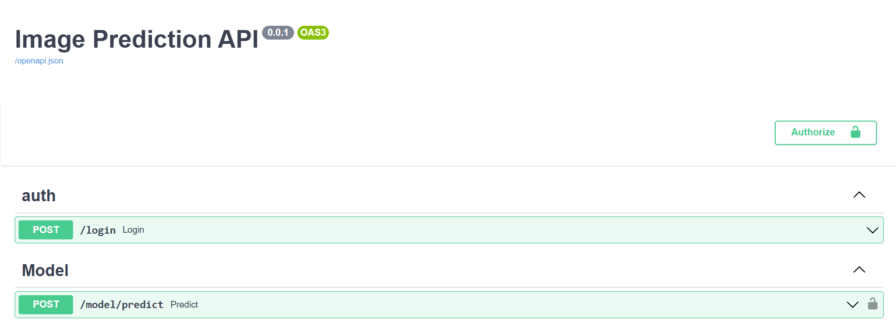

# Desarrollo de un sistema de diagnóstico de enfermedades y clasificación de especies en hojas de plantas mediante PlantCV y modelos de aprendizaje profundo

Descripcion: La detección temprana de enfermedades en cultivos es vital para la agricultura sostenible. Utilizando PlantCV (https://plantcv.readthedocs.io/), una biblioteca enfocada en la visión por computadora para plantas, junto con TensorFlow o PyTorch, el alumno se encargará de crear modelos de clasificación multiclase robustos. Estos modelos tendrán como objetivo identificar distintas enfermedades y una clase de salud en hojas de varias especies. Para el entrenamiento y evaluación, se usará el New Plant Diseases Dataset de Kaggle (https://www.kaggle.com/datasets/vipoooool/new-plant-diseases-dataset), que contiene más de 80,000 imágenes recogidas en entornos de laboratorio e in situ. Dada la naturaleza práctica de la aplicación, se buscará desarrollar un modelo lo suficientemente eficiente como para poder ser implementado en aplicaciones móviles, permitiendo diagnósticos ágiles y efectivos en el campo.


## Installation

To run the services using compose:

```bash
$ cp .env.original .env
```

```bash
$ docker network create shared_network
```

Only for mac M1 users:
- There is dockerfile for M1 macs model/Dockerfile.M1. This docker file downloads tensoflow compiled for M1
- Change docker-compose.yaml to use that docker file.
- Remove tensorflow for requirements.txt
- Remember change back docker-compose.yaml and requirements.txt in the submission.

**Warning:** You won't be able to start the proyect until you complete the Dockerfile found at `api` folder, as stated in the [ASSIGNMENT.md](./ASSIGNMENT.md) file.

```bash
$ docker-compose up --build -d
```

To stop the services:

```bash
$ docker-compose down
```

Populate the database:
```bash
cd api
cp .env.original .env
docker-compose up --build -d
```


## Access fastapi docs

URL = http://localhost:8000/docs




To try the endpoints you need Authorize with user = admin@example.com password = admin


## Access the UI

URL = http://localhost:9090


- Login with:
    - user: `admin@example.com`
    - pass: `admin`
- You can upload an image
- You can classify it


